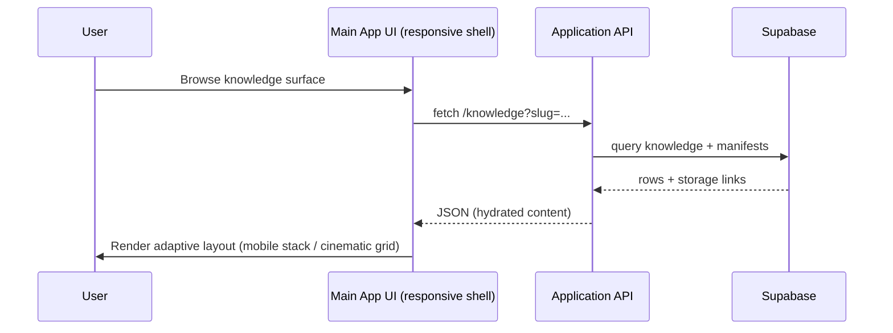

# Supabase & Next.js Adapter Integration Roadmap

## 1. Current Scaffolding Audit

### 1.1 Supabase schema stubs (`supabase/`)
- **Purpose** – Starter SQL bundles for CRM, marketing analytics, manufacturing RFQ, knowledge embeddings, and chat corpus tables. Files are ordered migrations (`0001_*.sql` – `0007_*.sql`). 【F:supabase/README.md†L1-L24】【F:supabase/schema/0001_crm.sql†L1-L62】
- **Conventions** – Uses `gen_random_uuid()` (requires `pgcrypto`), incremental indexes, optional RLS policies (commented), and placeholders for pgvector indices. 【F:supabase/README.md†L12-L24】
- **Gaps** – No automatic migration tooling, no seed data, and no schema synchronization scripts for the main app.

### 1.2 Next.js adapter example (`examples/next-adapter/`)
- **Purpose** – Standalone Next.js 14 app that exposes `/api/ingest/convert`, demonstrating md-convert proxying, optional Supabase storage writes, and sample UI shells for future surfaces (corpus, knowledge, research, etc.). 【F:examples/next-adapter/README.md†L1-L28】【F:examples/next-adapter/app/api/ingest/convert/route.ts†L1-L37】
- **Key libs** – Supabase helpers for storage & table writes, unzip wrapper, historian logger, corpus utilities. Environment toggles gate Supabase uploads. 【F:examples/next-adapter/lib/supabase.ts†L1-L22】【F:examples/next-adapter/lib/ingest/convert.ts†L1-L53】【F:examples/next-adapter/.env.example†L1-L7】
- **UI shell** – Inline-styled layout with responsive nav wrap and placeholder routes that need harmonizing with main app design system (currently custom CSS, no shared components). 【F:examples/next-adapter/app/layout.tsx†L1-L76】
- **Gaps** – Not wired into main repo routing, no shared state with primary app, no build orchestration for Vercel monorepo deployment.

## 2. Migration Plan (Supabase + Adapter → Main App)

### Phase 0 – Alignment & prerequisites
1. **Schema validation** – Run Supabase SQL in staging project; enable `pgcrypto` and confirm table names match expected ORM/data layer in `src/`. Export generated migration snapshots for reproducibility.
2. **Adapter refactor spike** – Identify reusable ingestion logic (md-convert proxy, storage upload, knowledge upsert) to migrate into shared `packages` or `src` modules. Ensure TypeScript targets align with repo TS config.
3. **Responsive baseline** – Audit existing main app breakpoints; define shared layout primitives ensuring mobile-first defaults and cinematic widescreen expansions per brand guides.

### Phase 1 – Shared services extraction
1. Move `lib/ingest/convert.ts`, `lib/supabase.ts`, and `lib/db.ts` into a shared workspace module (e.g., `packages/ingest-kit`) with isomorphic exports for Next.js (Edge-safe fallbacks) and Node usage.
2. Parameterize Supabase bucket/table names via central config loader that reads from environment and Vercel project settings.
3. Replace inline layout styles with shared responsive components (e.g., `Shell`, `NavRail`) that consume CSS variables/tokens used in main app, ensuring SSR-friendly styling (Tailwind, CSS Modules, or styled-system).

### Phase 2 – Main app integration
1. **API routing** – Mount ingestion endpoint in primary Next.js API or the repo's existing HTTP server (`src/server.ts`) depending on deployment target. Ensure streaming/file uploads respect Vercel Edge limits (use Node runtime when needed).
2. **Data persistence** – Wire Supabase writes for knowledge manifests and archives from ingestion flow; schedule incremental sync jobs to hydrate main store (`src/store` or pipeline modules).
3. **UI surfaces** – Replace example pages with production-ready responsive views embedded in main app routing, using adaptive layouts that stack on mobile and span multi-column on >1280px viewports.

### Phase 3 – Deployment hardening
1. Add Supabase migration automation (e.g., `supabase db push` or custom scripts) into CI and Vercel build steps.
2. Define Vercel build outputs for adapter routes and ensure monorepo config points `examples/next-adapter` to preview deployments when necessary.
3. Implement observability hooks (historian logs, Supabase error tracking) and fallback UI states for offline/slow storage interactions.

## 3. Environment Variables

| Variable | Required? | Description | Notes |
| --- | --- | --- | --- |
| `MD_CONVERT_URL` | ✅ | Base URL for md-convert worker used during ingestion. | Required for `/api/ingest/convert`. 【F:examples/next-adapter/.env.example†L1-L7】|
| `INGEST_SUPABASE` | ⚙️ | Toggle for Supabase storage/table writes (`true` to enable). | Default `false`; ensure boolean parsing in shared config. 【F:examples/next-adapter/lib/supabase.ts†L1-L22】|
| `SUPABASE_URL` | ✅ | Supabase project URL for both client and server helpers. | Must be set in Vercel Project Env & Supabase config. 【F:examples/next-adapter/lib/supabase.ts†L1-L22】|
| `SUPABASE_ANON_KEY` | ✅ (client) | Public key for client-side uploads if needed. | Keep rotated; avoid bundling in Edge runtime without guard. 【F:examples/next-adapter/lib/supabase.ts†L1-L22】|
| `SUPABASE_SERVICE_KEY` | ✅ (server) | Service-role key for server-side upserts. | Use Vercel encrypted env; never expose to browser. 【F:examples/next-adapter/lib/supabase/server.ts†L1-L7】|
| `SUPABASE_BUCKET_FILES` | ⚙️ | Storage bucket for archives/manifests. | Defaults to `files`; align with Supabase storage config. 【F:examples/next-adapter/lib/ingest/convert.ts†L31-L53】|
| `SUPABASE_TABLE_KNOWLEDGE` | ⚙️ | Table name for knowledge upserts. | Ensure matches schema migration (`knowledge`). 【F:examples/next-adapter/lib/db.ts†L1-L19】|

Configure environments via Vercel Project Settings → Environment Variables (Production, Preview, Development). Provide `.env.local` templates for contributors.

## 4. Data Flow Diagrams

```mermaid
flowchart LR
  A[Client Upload UI] -->|multipart/form-data| B[/api/ingest/convert\n(Next.js Node runtime)]
  B -->|POST /convert| C[md-convert Worker]
  C -->|ZIP bytes| B
  B -->|Process ZIP| D[Shared ingest kit]
  D -->|Storage uploads| E[(Supabase Storage)]
  D -->|Manifest+metadata| F[(Supabase Postgres)]
  F --> G[Main App Knowledge Pipeline]
```



## 5. Milestones & Dependencies

1. **M1 – Schema & config ready** (1 sprint)
   - Supabase project provisioned, migrations applied, env vars defined in Vercel.
   - Dependency: Supabase account access, secrets management approvals.
2. **M2 – Shared ingest kit** (1–2 sprints)
   - Common package extracted with md-convert + Supabase helpers, unit-tested.
   - Dependency: Agreement on module naming, TypeScript build pipeline updates.
3. **M3 – Integrated ingestion endpoint** (1 sprint)
   - `/api/ingest/convert` (or equivalent) served from main app, storing archives + manifests.
   - Dependency: Vercel Node runtime allocation, file upload limit verification.
4. **M4 – Responsive knowledge surfaces** (1–2 sprints)
   - Main app views consuming Supabase data with mobile-first, widescreen-enhanced layouts.
   - Dependency: Design tokens finalized, cross-team review for responsive behavior.
5. **M5 – Deployment hardening** (ongoing)
   - CI pipelines enforce migrations, secrets, and adapter smoke tests.
   - Dependency: Access to Vercel team settings, observability tooling.

## 6. Responsive UI & Vercel Deployment Considerations

- **Responsive ethos** – Adopt shared layout primitives (stack/grid) with CSS clamp-based typography to satisfy “optimized for mobile” while offering cinematic experiences on ≥1440px widths. Replace inline styles in example adapter with token-driven, theme-aware components.
- **Performance** – Use dynamic imports for heavy modules (`@xenova/transformers`) to avoid bloating initial Vercel bundles; gate analytics features on `prefers-reduced-data` where possible.
- **Vercel constraints** – Keep ingestion route on Node runtime due to `unzipit` and streaming needs; configure route segments in `vercel.json` if main app is hybrid. Ensure Supabase service key stays server-only via Vercel Environment (Production, Preview, Development).
- **Build orchestration** – Utilize Vercel monorepo settings to target the main app as primary build; run example adapter builds only for preview sandboxes. Add build cache for Supabase SQL tooling if introduced.

## 7. Next Actions

1. Stand up Supabase staging with schema stubs and document generated table structure snapshots.
2. Define shared `packages/ingest-kit` interface and migrate adapter utilities into it with tests.
3. Align design tokens with responsive requirements and refactor adapter layout to consume them before merging into main app.
4. Update CI/Vercel configs to inject required environment variables and run smoke tests against the ingestion endpoint.
